# HexaTerminal Codebase Architecture Report

## 1. Executive Summary
- Scope: corrective pass over the existing audit package; repository code is the source of truth for implementation claims.
- Repository identity: `main` at `b09a197f1ace0fb4c5f865703a9a65f087d99cc2`.
- Architecture: Laravel 12 at repo root, Next.js 16 App Router under `frontend/`, Filament 4 CMS at `/cms`, and legacy Blade/API surfaces still registered but isolated behind `legacy:*` middleware.
- Review status: `REVISION_REQUIRED`.
- Why not ready for owner review yet:
  - no canonical `HexaTerminal_Website_Execution_State*.json` file was found in the repository, so Step 11 could not be completed safely;
  - frontend quality commands are blocked because `frontend/node_modules` is absent;
  - several broader Laravel suites fail or warn due missing local `.env` / `APP_KEY` conditions, so runtime readiness is still partial.

## 2. Audit Scope and Safety Rules
- Modified files: only the six audit documents in `docs/hexaterminal-codebase-audit/`.
- Not modified: application source, config, migrations, lockfiles, `.env`, deployment manifests, database contents, Git history.
- Secrets: no secret values were printed; only variable names and structural behavior were documented.

## 3. Git and Repository Identity
| Item | Value |
|---|---|
| Repository root | `C:\Users\impos\Desktop\Projects\hexaterminal` |
| Branch | `main` |
| Commit | `b09a197f1ace0fb4c5f865703a9a65f087d99cc2` |
| Working tree at start | `?? docs/hexaterminal-codebase-audit/` |
| Existing uncommitted work | the audit directory itself was already untracked and was preserved |

## 4. Repository Structure
```text
.
|-- app/
|   |-- Console/
|   |-- Exceptions/
|   |-- Filament/
|   |   |-- Pages/
|   |   |-- Resources/
|   |   |-- Support/
|   |   `-- Widgets/
|   |-- Http/
|   |   |-- Controllers/
|   |   |   `-- Api/V1/Public/
|   |   |-- Middleware/
|   |   `-- Resources/
|   |-- Models/
|   |-- Notifications/
|   |-- Observers/
|   |-- Providers/
|   `-- Services/
|-- bootstrap/
|-- config/
|-- database/
|   |-- factories/
|   |-- migrations/
|   `-- seeders/
|-- deploy/staging/
|   |-- docker-compose.staging.yml
|   `-- nginx/
|-- docs/
|-- frontend/
|   |-- app/
|   |   |-- api/
|   |   `-- [locale]/
|   |-- components/
|   |-- i18n/
|   `-- lib/
|-- public/
|-- resources/
|-- routes/
`-- tests/
```
- Laravel authoritative concerns: API, CMS, content modeling, publication workflow, lead persistence, revalidation triggering.
- Next.js authoritative concerns: public rendering, metadata emission, route-level localization, client-side interactions, preview consumption.
- Legacy authoritative concerns: only historical compatibility; not the current target architecture.

## 5. Technology and Dependency Inventory
| Concern | Evidence |
|---|---|
| PHP CLI | `8.3.30` |
| Composer | `2.10.0` |
| Laravel | `12.64.0` |
| Filament constraint | `filament/filament ^4.0` |
| Node | `v24.11.0` |
| npm | `11.6.1` |
| Next.js | `16.2.10` |
| React | `19.2.4` |
| `vendor/` present | yes |
| `frontend/node_modules/` present | no |
| Safe test DB | `sqlite :memory:` in `phpunit.xml` |

## 6. Laravel Backend Architecture
- Bootstrap and runtime:
  - `public/index.php`
  - `bootstrap/app.php`
  - `app/Providers/{AppServiceProvider,RouteServiceProvider,AuthServiceProvider,EventServiceProvider,RouteCacheServiceProvider}.php`
- Route registration:
  - `routes/web.php` for legacy Blade/admin
  - `routes/api.php` for legacy API
  - `routes/api_v1.php` for current public JSON contract
  - `routes/health.php` for health probes
- Middleware of note:
  - `App\Http\Middleware\SetApiLocale`
  - `App\Http\Middleware\SecurityHeaders`
  - `App\Http\Middleware\ResponseCache`
  - `App\Http\Middleware\LegacySurface`
  - `App\Http\Middleware\AdminMiddleware`
- Public controllers are inline-validation controllers, not FormRequest-driven, under `app/Http/Controllers/Api/V1/Public`.
- Cross-cutting services and support:
  - `App\Services\RevalidationService`
  - `App\Services\LeadScoringService`
  - `App\Services\ContentCompletenessReport`
  - `App\Services\PreviewTokenService`
  - `App\Http\Controllers\Api\V1\Public\Concerns\CachesPublicResponses`
- Notifications and mail:
  - `App\Notifications\NewLeadNotification`
- Observers:
  - `App\Observers\ClearsPublicApiCache`
- Queue / scheduler:
  - queue support exists, but the safe test environment uses `QUEUE_CONNECTION=sync`;
  - no meaningful scheduled task inventory was verified from this pass.

## 7. Database and Data Model
- Modern public content tables and models:
  - `service_offerings` -> `Service`
  - `systems` -> `System`
  - `case_studies` -> `CaseStudy`
  - `industries` -> `Industry`
  - `articles` -> `Article`
  - `article_categories` -> `ArticleCategory`
  - `article_tags` -> `ArticleTag`
  - `team_members` -> `TeamMember`
  - `testimonials` -> `Testimonial`
  - `faqs` -> `FaqItem`
  - `trust_pages` -> `TrustPage`
  - `public_claims` -> `PublicClaim`
  - `contact_leads` -> `ContactLead`
  - `pricing_profiles` -> `PricingProfile`
  - `engagement_models` -> `EngagementModel`
  - `estimator_versions` / `estimator_questions` / `estimator_rules` / `cost_estimates`
  - `seo_meta`, `content_previews`, `content_activities`, `company_settings`
- Legacy coexistence remains visible through models/tables such as `Services`, `Projects`, `Team`, `About_Us`, `Contact_Us`, `Review`, `Video`.
- Data-behavior patterns verified in code:
  - translated fields are stored with Spatie Translatable;
  - publication is guarded by `Publishable` / `HasEditorialWorkflow` concerns;
  - slugs are generated centrally through `HasAutoSlug`;
  - team publication adds a governance gate through `publication_consent`;
  - trust pages require additional approval flags before being truly public-ready.

## 8. API Route Matrix
| Method | URI | Controller@method | Cache | Validation | Auth / Authz | Frontend consumer | Tests |
|---|---|---|---|---|---|---|---|
| GET | `/api/v1/public/home` | `HomeController@index` | route cache headers + app cache | none | anonymous | `frontend/app/[locale]/page.tsx` | API suite broad coverage |
| GET | `/api/v1/public/services` | `ServiceController@index` | cached | query params only | anonymous | services hub | API V1 tests |
| GET | `/api/v1/public/services/{slug}` | `ServiceController@show` | cached | slug path only | anonymous | service detail | content visibility coverage |
| GET | `/api/v1/public/systems` | `SystemController@index` | cached | `type`, `featured`, pagination | anonymous | systems hub | API V1 tests |
| GET | `/api/v1/public/systems/{slug}` | `SystemController@show` | cached | slug path only | anonymous | system detail | published content visibility |
| GET | `/api/v1/public/case-studies` | `CaseStudyController@index` | cached | `featured`, pagination | anonymous | case studies hub | API V1 tests |
| GET | `/api/v1/public/case-studies/{slug}` | `CaseStudyController@show` | cached | slug path only | anonymous | case study detail | API V1 tests |
| GET | `/api/v1/public/industries` | `IndustryController@index` | cached | none | anonymous | industries hub + home | API V1 tests |
| GET | `/api/v1/public/industries/{slug}` | `IndustryController@show` | cached | slug path only | anonymous | industry detail | API V1 tests |
| GET | `/api/v1/public/articles` | `ArticleController@index` | cached | `category`, `tag`, `featured`, pagination | anonymous | insights hub | `ArticleCategoryTest`, `LocaleAndPaginationTest` |
| GET | `/api/v1/public/articles/{slug}` | `ArticleController@show` | cached | slug path only | anonymous | article detail | `PublishedContentVisibilityTest` |
| GET | `/api/v1/public/article-categories` | `ArticleCategoryController@index` | cached | none | anonymous | insights filters | `ArticleCategoryTest` |
| GET | `/api/v1/public/search` | `SearchController@index` | uncached | query string | anonymous | `/[locale]/search` | `SearchTest` |
| GET | `/api/v1/public/settings` | `SettingsController@index` | cached | none | anonymous | shared shell/footer | `SettingsTest` |
| GET | `/api/v1/public/team` | `TeamMemberController@index` | cached | none | anonymous | about/team pages | `PublishedContentVisibilityTest` |
| GET | `/api/v1/public/team/{slug}` | `TeamMemberController@show` | cached | slug path only | anonymous | team detail-capable consumer | API suite broad coverage |
| GET | `/api/v1/public/trust-pages` | `TrustPageController@index` | cached | none | anonymous | trust routes | `TrustPageVisibilityTest` |
| GET | `/api/v1/public/trust-pages/{slug}` | `TrustPageController@show` | cached | slug path only | anonymous | trust detail routes | `TrustPageVisibilityTest` |
| GET | `/api/v1/public/testimonials` | `TestimonialController@index` | cached | optional `featured` | anonymous | home / proof blocks | API suite broad coverage |
| GET | `/api/v1/public/faqs` | `FaqController@index` | cached | none | anonymous | home / pricing | API suite broad coverage |
| GET | `/api/v1/public/pricing` | `PricingController@index` | cached | `currency` | anonymous | pricing page | `PricingApiTest` |
| GET | `/api/v1/public/estimator` | `EstimatorController@config` | cached | none | anonymous | estimate entry page | `EstimatorApiTest` |
| POST | `/api/v1/public/estimates` | `EstimatorController@store` | no cache | inline validator | anonymous + throttle | Next proxy `/api/estimates` | `EstimatorApiTest` |
| GET | `/api/v1/public/estimates/{uuid}` | `EstimatorController@show` | no cache | UUID path | anonymous | `/[locale]/estimate/[uuid]` | `EstimatorApiTest` |
| POST | `/api/v1/public/estimates/{uuid}/lead` | `EstimatorController@submitLead` | no cache | inline validator | anonymous + throttle | Next proxy `/api/estimates/[uuid]/lead` | `EstimatorApiTest` |
| GET | `/api/v1/public/redirects` | `RedirectController@index` | cached | none | anonymous | `next.config`/routing consumers | `CacheInvalidationTest` broad relevance |
| GET | `/api/v1/public/preview/{token}` | `PreviewController@show` | deliberately uncached | token service | anonymous token auth | `/[locale]/preview/[token]` | `PreviewControllerTest` |
| POST | `/api/v1/public/leads` | `LeadController@store` | no cache | inline validator + honeypot + optional Turnstile | anonymous + throttle | Next proxy `/api/leads` | `LeadsTest`, `LeadIntentAndAttributionTest`, rate-limit tests |
| POST | `/api/v1/public/newsletter` | `NewsletterController@store` | no cache | inline validator + honeypot | anonymous + throttle | frontend newsletter use | `NewsletterTest` |

## 9. Filament Dashboard Architecture
- Panel provider: `app/Providers/Filament/CmsPanelProvider.php`
- Panel id/path: `cms` / `/cms`
- Navigation groups, in configured order:
  - Offerings
  - Proof
  - Content
  - Pricing
  - Leads
  - SEO
  - Trust & Governance
  - Settings
- Discovery:
  - resources from `app/Filament/Resources`
  - pages from `app/Filament/Pages`
  - widgets from `app/Filament/Widgets`
- Built-in widgets additionally registered:
  - `AccountWidget`
  - `FilamentInfoWidget`
- MFA:
  - Filament app-authentication TOTP is required only for `admin` users.

## 10. Next.js Frontend Architecture
- App Router root: `frontend/app`
- Public localized routes live under `frontend/app/[locale]`
- Shared shell: `frontend/app/[locale]/layout.tsx`
- Data client: `frontend/lib/api/client.ts`
- Localization helpers:
  - `frontend/i18n/routing.ts`
  - `frontend/i18n/navigation.ts`
  - `frontend/i18n/request.ts`
- SEO / structured data helpers:
  - `frontend/lib/seo/page-metadata.ts`
  - `frontend/lib/seo/alternates.ts`
  - `frontend/lib/seo/jsonld.ts`
- Route handlers:
  - `/api/leads`
  - `/api/estimates`
  - `/api/estimates/[uuid]/lead`
  - `/api/revalidate`
  - `/api/health`
  - `/api/csp-report`
- Rendering pattern:
  - major pages are server components;
  - API fetches use Next `fetch` with `next.revalidate`;
  - search and preview deliberately bypass cache;
  - locale-specific HTML `lang` and `dir` are set in layout.

## 11. Complete Page-to-Code Map
| Route family | Page file | Primary API client calls | Main components |
|---|---|---|---|
| home | `frontend/app/[locale]/page.tsx` | `getHome`, `getArticles`, `getFaqs`, `getIndustries` | `Hero`, `Showreel`, `ServiceCard`, `SystemCard`, `CaseStudyCard`, `ArticleCard`, `CTA` |
| services | `services/(list)/page.tsx`, `services/[slug]/page.tsx` | `getServices`, `getService` | `ServiceCard`, `Breadcrumb`, `CTA` |
| systems | `systems/(list)/page.tsx`, `systems/[slug]/page.tsx` | `getSystems`, `getSystem` | `SystemCard`, `Breadcrumb`, `CTA` |
| case studies | `case-studies/(list)/page.tsx`, `case-studies/[slug]/page.tsx` | `getCaseStudies`, `getCaseStudy` | `CaseStudyCard`, `JsonLd`, `ViewTracker` |
| industries | `industries/(list)/page.tsx`, `industries/[slug]/page.tsx` | `getIndustries`, `getIndustry` | `Breadcrumb`, cards, CTA |
| insights | `insights/(list)/page.tsx`, `insights/[slug]/page.tsx` | `getArticles`, `getArticle`, `getArticleCategories` | `ArticleCard`, `Breadcrumb`, `JsonLd` |
| about / team | `about/page.tsx`, `team/page.tsx` | `getTeam`, `getTrustPages`, settings data via shell | `TrustPageView`, people/profile blocks |
| conversion | `contact/page.tsx`, `start-a-project/page.tsx`, `estimate/page.tsx`, `estimate/[uuid]/page.tsx`, `pricing/page.tsx` | `getPricing`, `getEstimatorConfig`, `getEstimate` | `LeadForm`, `CostEstimator`, `EstimateResult` |
| trust/legal | `security`, `process`, `accessibility`, `technology`, `responsible-ai`, `engineering-standards`, `privacy`, `terms` | trust-page and shell helpers | `TrustPageView`, `LegalProse` |
| utility | `search/page.tsx`, `preview/[token]/page.tsx`, `not-found.tsx`, `error.tsx` | `search`, `getPreview` | `PageSkeleton`, `EmptyState`, preview renderer |

## 12. Frontend/Backend Integration Map
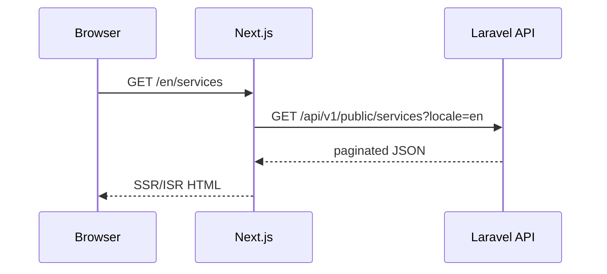

## 13. Localization and Content Architecture
- Route locale is always path-based: `/en/...`, `/ar/...`.
- `generateStaticParams()` in the layout enumerates both locales.
- `setRequestLocale(locale)` is applied in route handlers/pages.
- Backend locale is request-driven through `SetApiLocale`.
- `config/app.php` fallback locale is `en`, so the reported “Arabic under `/en`” issue was not reproduced as a code-path fallback defect.
- Strong inference from code:
  - if Arabic appears on English pages in production, the more likely causes are translatable field content quality, migration/import defects, or CMS editorial entry, not framework locale fallback.

## 14. Forms and Lead Flow
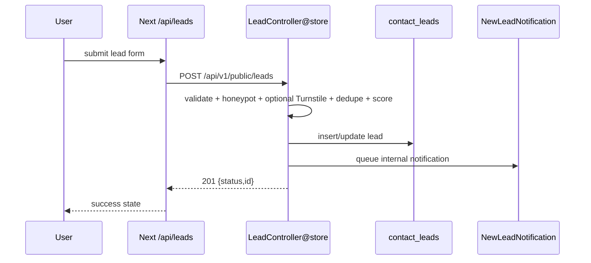
- Verified overlap: `/contact` and `/start-a-project` both use the same `LeadForm` component and same backend route, differing mainly by copy and `sourcePage`.

## 15. Authentication and Authorization
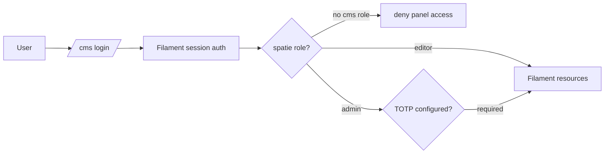
- `AuthServiceProvider` does not currently register a policy map.
- Practical access control is instead distributed across:
  - `User::canAccessPanel(...)`
  - Spatie role checks
  - Filament panel middleware
  - inline action authorization closures in selected tables, especially `ContactLeadsTable`
  - feature tests such as `FilamentAuthorizationTest` and `FilamentMfaTest`

## 16. SEO Architecture
- Route-level metadata is generated in page files plus `pageMetadata`.
- Alternates / hreflang are generated through `localeAlternates`.
- Structured data helpers exist for organization, website, FAQ, article, breadcrumbs, person, and other route types.
- CMS-backed SEO relation: `SeoMeta`.
- Verified distinction:
  - architecture for metadata is strong;
  - quality of actual SEO output still depends on CMS record completeness.

## 17. Performance Review
| Category | Classification | Evidence |
|---|---|---|
| Public API list/read caching | `MEASURED_IN_CODE` | route cache headers plus `CachesPublicResponses` 300-second remember logic |
| Search endpoint | `MEASURED_IN_CODE` | deliberately uncached in controller and frontend client |
| Server/client boundary | `MEASURED_IN_CODE` | server component fetches dominate public pages |
| Revalidation | `STATIC_CODE_RISK` | observer-driven invalidation exists, but full production freshness was not runtime-verified |
| Large media/showreel | `STATIC_CODE_RISK` | modal/poster/`preload="none"` mitigate load, but asset-size budget not measured |
| Filament counts/widgets | `STATIC_CODE_RISK` | dashboard widgets call live counts; no benchmark evidence |
| Bundle/build health | `NOT VERIFIED` | frontend build could not run because dependencies are not installed |

## 18. Accessibility Architecture
- Verified positives:
  - skip link in layout;
  - locale-sensitive `dir` and `lang`;
  - reusable UI primitives under `frontend/components/ui`;
  - existing Playwright accessibility coverage is present in the repo.
- Not fully verified:
  - rendered-color contrast, keyboard traps, screen-reader labeling, and Arabic typography quality on a live build.

## 19. Security Review
| ID | Severity | Status | Surface | Evidence | Residual risk |
|---|---|---|---|---|---|
| SEC-01 | Medium | `VERIFIED` | Public API | throttles on lead/newsletter/estimate endpoints | depends on deployment retaining same middleware |
| SEC-02 | Medium | `VERIFIED` | Lead intake | honeypot + dedupe + optional Turnstile in `LeadController` | Turnstile is fail-open if service unavailable |
| SEC-03 | Medium | `VERIFIED` | Revalidation | shared-secret route and replay window design | secret deployment state not verified |
| SEC-04 | Medium | `VERIFIED` | CMS auth | Filament MFA required for admins | editor MFA not required by current policy |
| SEC-05 | Low | `VERIFIED` | Security headers | `SecurityHeaders` middleware and frontend CSP/report route exist | CSP still report-only on Laravel side |
| SEC-06 | Medium | `PARTIALLY_CONFIRMED` | Legacy surfaces | fail-closed middleware exists | safe only if flags remain disabled in deployment |

## 20. Testing and Quality
| Command | Result | Notes |
|---|---|---|
| `composer validate --no-check-publish` | pass | valid manifest |
| `php artisan route:list --json` | pass | succeeded with longer timeout |
| `vendor\\bin\\pint --test` | fail | formatting issues in existing app files; audit did not change code |
| `vendor\\bin\\phpstan analyse --no-progress` | blocked/timeout | no conclusion |
| `php artisan test tests/Feature/Api/V1 --compact` | pass with warnings | 49 warnings, 153 assertions |
| `php artisan test tests/Feature/Security --compact` | fail | many failures when `APP_KEY` missing |
| `php artisan test tests/Feature/Cms tests/Feature/RevalidationTest.php tests/Feature/Pricing --compact` | fail | many failures when `APP_KEY` missing |
| `APP_KEY=... php artisan test` targeted slices | pass with warnings | security, cms, pricing/revalidation slices below |
| `frontend: npm run typecheck` | blocked | `tsc` missing because deps not installed |
| `frontend: npm run lint` | blocked | `eslint` missing because deps not installed |
| `frontend: npm run build` | blocked | `next` missing because deps not installed |

## 21. Deployment and Operations
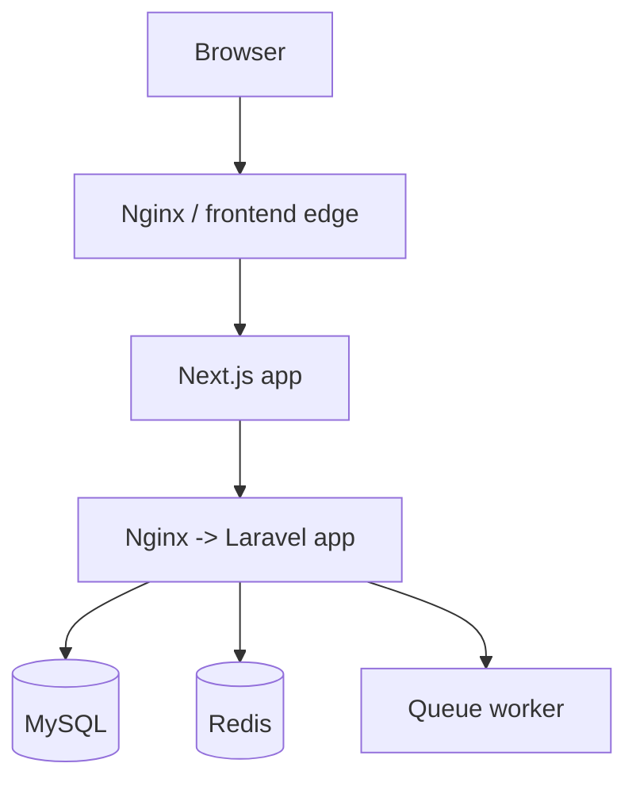
- Evidence present:
  - `deploy/staging/docker-compose.staging.yml`
  - `deploy/staging/nginx/api-staging.conf`
  - `deploy/staging/nginx/frontend-staging.conf`
- Missing hard evidence from this pass:
  - live worker supervision
  - scheduler process
  - backup automation
  - monitoring / alerting
  - rollback runbooks

## 22. Maintainability Findings
- Modern and legacy schemas coexist, which keeps migration risk high.
- Naming is mixed between singular modern models and legacy pluralized models.
- Trust/public-claim governance is stronger than many repositories, but editorial completeness still depends on disciplined content entry rather than hard mandatory workflows everywhere.

## 23. Technical Debt
- legacy Blade/public/admin routes still ship in the same repository;
- root Laravel frontend assets and the Next.js app coexist;
- no centralized FormRequest layer exists for public API validation;
- no policy map was verified in `AuthServiceProvider`.

## 24. Critical Unknowns
- canonical execution-state file location;
- real CMS content quality and approval state;
- production queue/mail/revalidation infrastructure;
- analytics provider activation;
- frontend build and bundle state in a dependency-installed environment.

## 25. Recommended Implementation Order
1. Phase 0 baseline and access verification.
2. CMS/data quality verification for bilingual content, trust pages, team publication, and placeholder URLs.
3. Environment verification for queue, mail, revalidation, analytics, and frontend dependency installation.
4. Only then targeted implementation work against the confirmed issues.

## 26. Architecture Diagrams
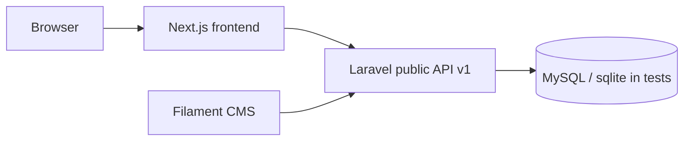

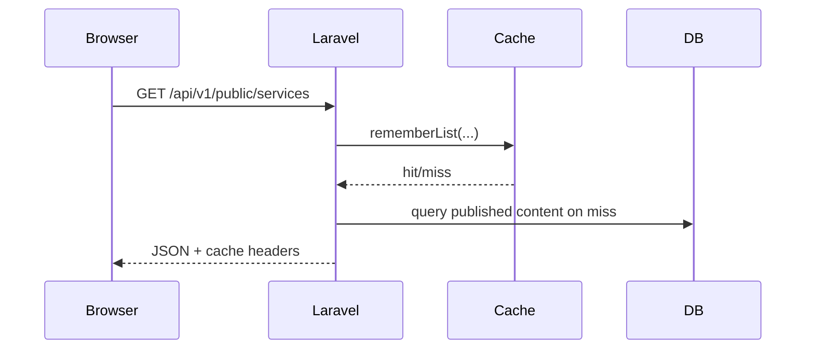

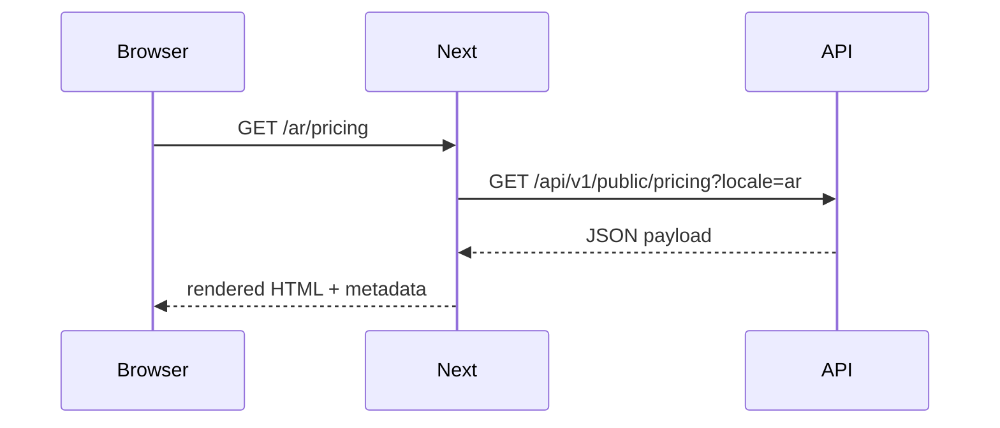

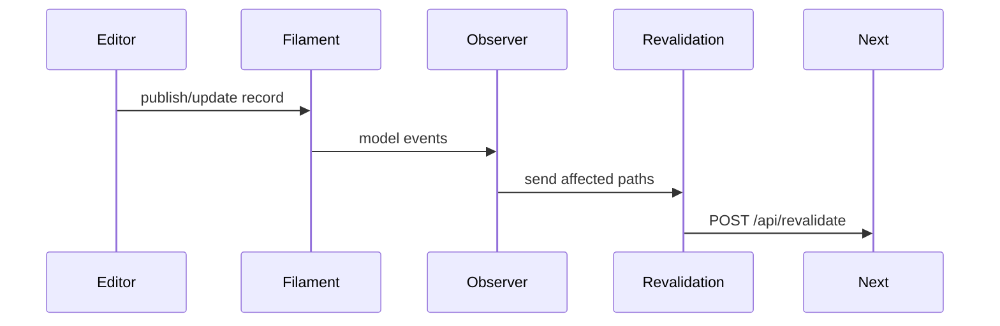

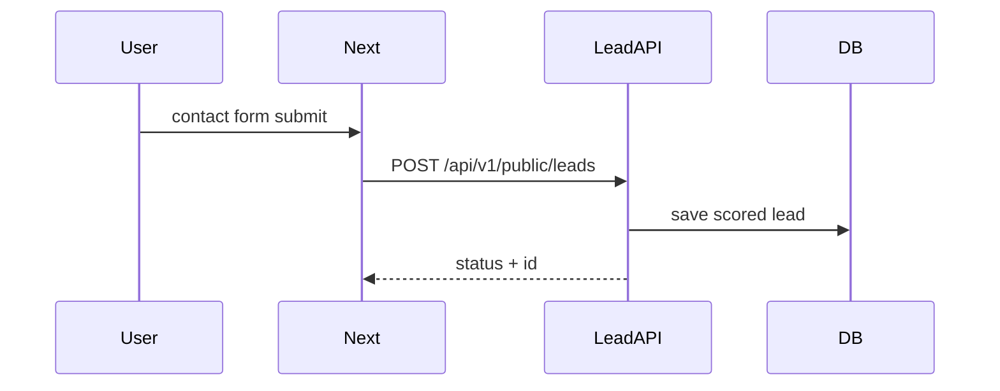

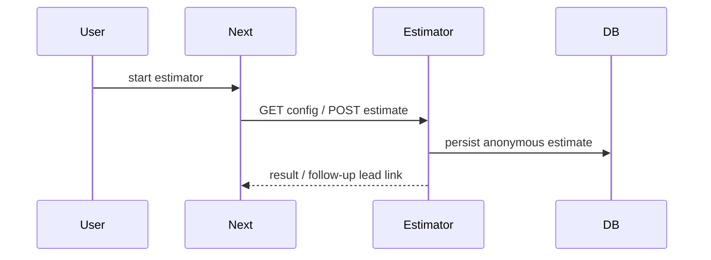

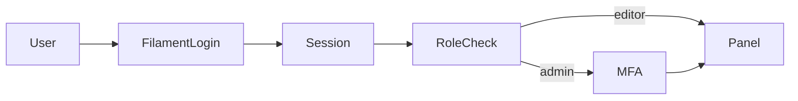

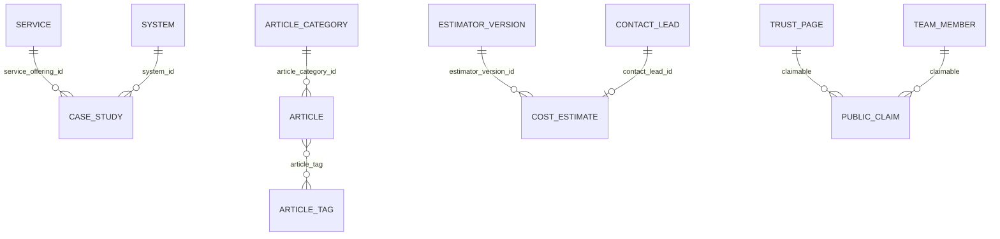

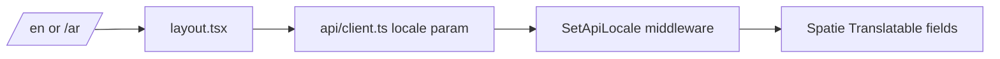

## 27. File and Symbol Index
- Public API routes: `routes/api_v1.php`
- Legacy routes: `routes/web.php`
- Panel provider: `app/Providers/Filament/CmsPanelProvider.php`
- Lead flow: `LeadController::store`, `NewLeadNotification`, `frontend/components/site/lead-form.tsx`
- Estimator flow: `EstimatorController::{config,store,show,submitLead}`
- Revalidation: `ClearsPublicApiCache`, `RevalidationService`, `frontend/app/api/revalidate/route.ts`
- Route registry: `frontend/lib/routes/registry.ts`
- Layout and locale shell: `frontend/app/[locale]/layout.tsx`

## 28. Commands Executed
- `git status --short`
- `php artisan --version`
- `php artisan route:list --json`
- `composer validate --no-check-publish`
- `vendor\\bin\\pint --test`
- `vendor\\bin\\phpstan analyse --no-progress`
- `php artisan test tests/Feature/Api/V1 --compact`
- `php artisan test tests/Feature/Security --compact`
- `php artisan test tests/Feature/Cms tests/Feature/RevalidationTest.php tests/Feature/Pricing --compact`
- `APP_KEY=... php artisan test tests/Feature/Security/{FilamentAuthorizationTest,FilamentMfaTest,RateLimitingTest}.php --compact`
- `APP_KEY=... php artisan test tests/Feature/Cms/{AllResourcesRenderTest,ServiceResourceTest}.php --compact`
- `APP_KEY=... php artisan test tests/Feature/Pricing/{EstimatorApiTest,PricingApiTest}.php tests/Feature/RevalidationTest.php --compact`
- `npm run typecheck`
- `npm run lint`
- `npm run build`

## 29. Commands That Could Not Be Executed
- canonical execution-state file update: blocked because no canonical file was found in the repository;
- frontend quality/build commands: blocked by absent `frontend/node_modules`;
- full phpstan / full feature suite: timed out or were inconclusive in the current environment.

## 30. Final Readiness Assessment
- Ready:
  - repository structure is understood;
  - public API and frontend boundary are well mapped;
  - Filament resource inventory is verified;
  - issue list is implementable at code/data-routing level.
- Partially ready:
  - runtime validation;
  - CMS content readiness;
  - deployment assumptions;
  - owner adoption of this audit package.
- Blocked:
  - execution-state JSON update;
  - frontend dependency-backed validation.
- Technical verdict: `REVISION_REQUIRED`.
